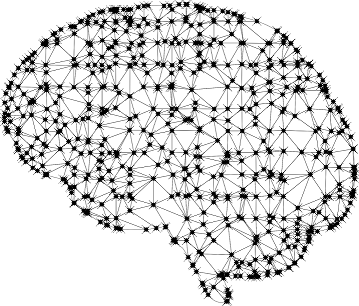

# Machine Learning Guide

### Neural Networks

#### Gradient Descent
##### Articles
  - [Difference between Batch Gradient Descent and Stochastic Gradient Descent](https://towardsdatascience.com/difference-between-batch-gradient-descent-and-stochastic-gradient-descent-1187f1291aa1)
#### Convolutional Neural Networks
##### Articles
  - [Architecture of Convolutional Neural Networks (CNNs) demystified](https://www.analyticsvidhya.com/blog/2017/06/architecture-of-convolutional-neural-networks-simplified-demystified/)
  - [Intuitively Understanding Convolutions for Deep Learning](https://towardsdatascience.com/intuitively-understanding-convolutions-for-deep-learning-1f6f42faee1)

##### Videos
  - [A friendly introduction to Convolutional Neural Networks and Image Recognition](https://www.youtube.com/watch?v=2-Ol7ZB0MmU)

#### Recurrent Neural Networks
##### Articles
  - [Fundamentals of Deep Learning – Introduction to Recurrent Neural Networks](https://www.analyticsvidhya.com/blog/2017/12/introduction-to-recurrent-neural-networks/)

##### Videos
  - [A friendly introduction to Recurrent Neural Networks](https://www.youtube.com/watch?v=UNmqTiOnRfg)
  - [Recurrent Neural Networks (RNN) and Long Short-Term Memory (LSTM)](https://www.youtube.com/watch?v=WCUNPb-5EYI)

#### Backpropagation
##### Articles
  - [A Step by Step Backpropagation Example](https://mattmazur.com/2015/03/17/a-step-by-step-backpropagation-example/)

## Unsupervised Learning
#### Pricipal Component Analysis (PCA)
##### Videos
  - [StatQuest: Principal Component Analysis (PCA) clearly explained (2015)](https://www.youtube.com/watch?v=_UVHneBUBW0)
  - [StatQuest: Principal Component Analysis (PCA), Step-by-Step](https://www.youtube.com/watch?v=FgakZw6K1QQ)

#### Autoencoders
##### Articles
  - [Applied Deep Learning - Part 3: Autoencoders](https://towardsdatascience.com/applied-deep-learning-part-3-autoencoders-1c083af4d798)

#### Matrix Factorization
##### Videos
  - [How does Netflix recommend movies? Matrix Factorization](https://www.youtube.com/watch?v=ZspR5PZemcs)

#### Expectation Maximization
##### Videos
- [EM algorithm: how it works](https://www.youtube.com/watch?v=REypj2sy_5U)
- [Expectation Maximization: how it works](https://www.youtube.com/watch?v=iQoXFmbXRJA)
